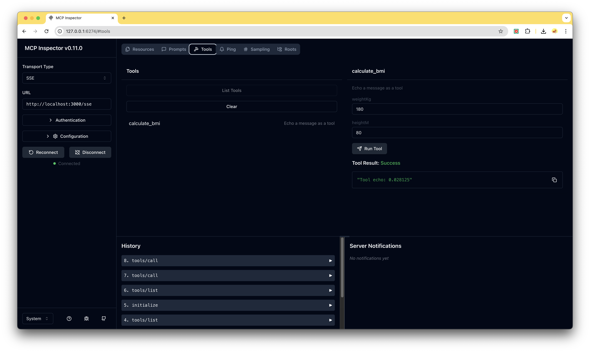

# python-server-sse
Python SDK를 사용하고 SSE Transport 방식으로 구현합니다.

## 프로젝트 초기 생성
[QuickStart](https://modelcontextprotocol.io/quickstart/server#python)

```
> curl -LsSf https://astral.sh/uv/install.sh | sh
> uv init .
> uv venv
> source .venv/bin/activate
> uv add "mcp[cli]" httpx
```

## 로컬 확인
### MCP Server 실행
```
> uv run main.py
```

## MCP Inspector 실행

```
> uv run mcp dev main.py
Starting MCP inspector...
⚙️ Proxy server listening on port 6277
🔍 MCP Inspector is up and running at http://127.0.0.1:6274 🚀
```


