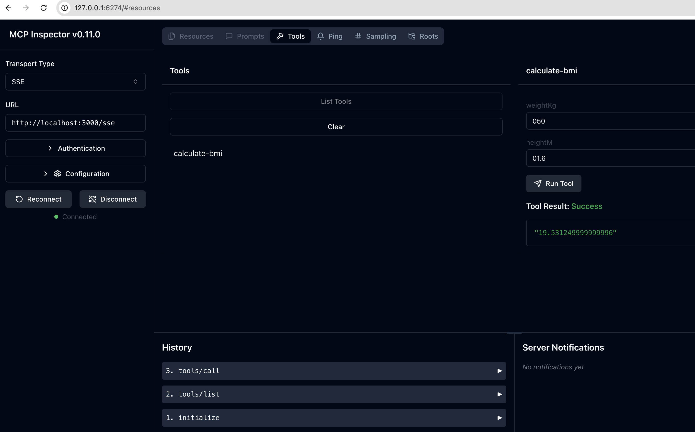

# typescript-server-sse
TypeScript SDK를 사용하고 SSE Transport 방식으로 구현합니다.

## 프로젝트 초기 생성
[QuickStart](https://modelcontextprotocol.io/quickstart/server#node)

```
> npm init -y
> npm install @modelcontextprotocol/sdk zod
> npm install -D @types/node typescript
> mkdir src
> touch src/index.ts
```
## 로컬 확인
### MCP Server 실행
```
> npm run build
> npm run start
```

## MCP Inspector 실행

```
> npx @modelcontextprotocol/inspector node build/index.js
⚙️ Proxy server listening on port 6277
🔍 MCP Inspector is up and running at http://127.0.0.1:6274 🚀
```


